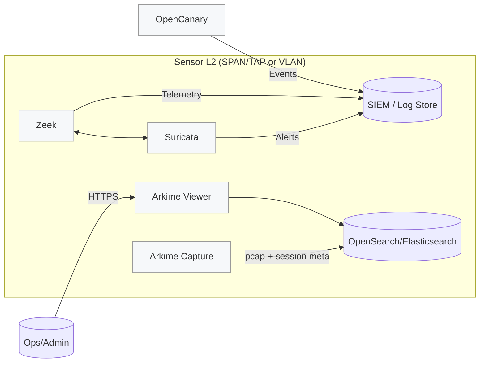

# Docker-IDS-Sensor 

> **Purpose.** A reproducible, Docker‑based **network security lab** that brings together:
>
> - **Suricata** and **Zeek** for IDS/NSM
> - **Arkime** for full‑packet capture & session search (backed by OpenSearch/Elasticsearch)
> - **OpenCanary** as a low‑interaction honeypot
>
> This repository is intentionally **not** a turnkey product. It’s a **PoC/lab scaffold** for practitioners who are comfortable editing Docker and tool configs. Use it to stand up a sensor stack quickly, validate detections, and prototype data flows.

---

## Contents

- [What You Get](#what-you-get)
- [Repository Layout](#repository-layout)
- [Reference Architecture](#reference-architecture)
- [Prerequisites](#prerequisites)
- [Quick Start](#quick-start)
- [Configuration Checklist](#configuration-checklist)
- [Operations](#operations)
- [Security Hardening Notes](#security-hardening-notes)
- [Troubleshooting](#troubleshooting)
- [FAQ](#faq)
- [Credits & License](#credits--license)

---

## What You Get

**Components**

- **Suricata** — signature‑based IDS, generates `eve.json`/alerts and optional PCAPs.
- **Zeek** — protocol‑aware network telemetry (e.g., `conn.log`, `dns.log`, `http.log`, etc.).
- **Arkime** — full‑packet capture with session indexing and a web UI (“viewer”); requires **OpenSearch/Elasticsearch** as the datastore.
- **OpenCanary** — honeypot services (e.g., SSH/FTP/HTTP) to attract and alert on opportunistic scans.

**Networking**

- Optional **macvlan** network for sensor interfaces. This keeps management traffic separate from capture/production segments and helps when attaching the stack to SPAN/TAP or dedicated sensor VLANs.

> The original README highlights macvlan parameters to tailor in the start script and per‑tool interface settings. The Arkime setup is split into **init**, **capture**, and **viewer** containers and expects an OpenSearch/Elasticsearch backend.

---

## Repository Layout

```
Docker-IDS-Sensor/
├─ arkime-docker/          # Arkime init, capture, and viewer containers; config.ini and compose
├─ opencanary-docker/      # OpenCanary container with .opencanary.conf and compose
├─ suricata-docker/        # Suricata assets (suricata.yaml, local.rules, compose)
├─ zeek-docker/            # Zeek assets (scripts/, zeekctl.cfg or command args, compose)
├─ init-and-start_IDS_Honeypot.sh  # Helper script to create macvlan and start stacks
└─ README.md               # Project overview and guidance
```

> Tip: You **can** ignore the helper script and start each component with `docker compose` from its directory once you’ve edited configs.

---

## Reference Architecture



**Key ideas**

- **Zeek** and **Suricata** observe the same traffic; Suricata raises signature alerts, Zeek yields rich, structured logs.
- **Arkime** stores/serves PCAPs + session metadata in **OpenSearch/Elasticsearch** and exposes a **web viewer**.
- **OpenCanary** is optional but useful to validate alerting and to surface low‑noise findings in a lab.

---

## Prerequisites

- Linux host (bare‑metal or VM) with **Docker Engine** and **Docker Compose v2**.
- One or more NICs you can dedicate to **capture** (SPAN/TAP preferred) or use **macvlan** on a sensor VLAN.
- **Disk space**: PCAPs and indices grow quickly (size accordingly).
- **OpenSearch/Elasticsearch** reachable from Arkime (or run it locally in a separate stack, if desired).

---

## Quick Start

> ⚠️ **Edit configs first.** This project assumes you’ll set proper interfaces, IPs, and datastore endpoints before starting.

### 1) Clone

```bash
git clone https://github.com/ninko0/Docker-IDS-Sensor.git
cd Docker-IDS-Sensor
```

### 2) (Optional) Create a macvlan network

Replace variables with values appropriate for your environment (sensor VLAN/subnet and host parent NIC).

```bash
PARENT_IF=enp3s0         # Host NIC connected to SPAN/TAP or sensor VLAN
SUBNET=192.168.50.0/24
GATEWAY=192.168.50.1
NET_NAME=ids_macvlan

docker network create -d macvlan \
  --subnet="$SUBNET" --gateway="$GATEWAY" \
  -o parent="$PARENT_IF" "$NET_NAME"
```

> If you use the provided `init-and-start_IDS_Honeypot.sh`, ensure the macvlan parameters in the script match your environment.

### 3) Configure each component

Follow the [Configuration Checklist](#configuration-checklist).

### 4) Start the stack

You can either use the helper script _or_ start per‑component with Compose:

```bash
# Helper script (all‑in‑one bootstrap)
bash ./init-and-start_IDS_Honeypot.sh

# OR: Start each component after editing its compose file
# (from within each component directory)
docker compose up -d
```

### 5) Smoke‑test

- Generate traffic across the monitored interface(s).
- Confirm **Suricata** writes `eve.json` and alerts.
- Confirm **Zeek** logs populate (`conn.log` etc.).
- Confirm **Arkime Viewer** is reachable and sessions are indexed.
- Hit an **OpenCanary** service (e.g., SSH/FTP/HTTP) and see an event.

---

## Configuration Checklist

### Global / Start Script

- **macvlan**: set `subnet`, `gateway`, `parent` (host interface), and the network `name`.
- **Container names**: decide on a consistent naming convention if you don’t use the defaults.

### Suricata (`suricata-docker/`)

- **Interface binding**: in `docker-compose.yml` (either `network_mode: host` or attach to your macvlan).
- **Rules**: edit `local.rules`; set `HOME_NET` / `EXTERNAL_NET` in `suricata.yaml` to match your lab.
- **Egress**: configure EVE output (JSON) and any log shipping (e.g., to ELK/Opensearch/Loki).

**Example `local.rules` entry**

```suricata
alert http any any -> $HOME_NET any (msg:"LAB web shell attempt"; content:"cmd="; http_uri; classtype:web-application-attack; sid:1000001; rev:1;)
```

### Zeek (`zeek-docker/`)

- **Interface**: set the monitored interface in `docker-compose.yml` or the Zeek command.
- **Custom script(s)**: check `scripts/` (e.g., a `canary.zeek` script) for lab‑specific IPs or services and update them.
- **Log path/rotation**: ensure persistent volumes and sensible retention.

**Example compose excerpt**

```yaml
services:
  zeek:
    network_mode: host              # or attach to ids_macvlan
    command: ["zeek", "-i", "enp3s0"]
    volumes:
      - ./logs:/usr/local/zeek/logs
```

### OpenCanary (`opencanary-docker/`)

- **Names**: align container names in `docker-compose.yml` with node IDs in `.opencanary.conf`.
- **Networks/IPs**: ensure services listen on your intended interface(s).
- **Services**: explicitly enable/disable service emulations (SSH/FTP/HTTP, etc.) and configure banners/creds.

**Example `.opencanary.conf` excerpt**

```json
{
  "device.node_id": "lab-canary-01",
  "logger": {"class": "PyLogger", "kwargs": {"formatters": {"plain": {"format": "%(message)s"}}}},
  "ssh.enabled": true, "ftp.enabled": true, "http.enabled": true
}
```

### Arkime (`arkime-docker/`)

- **Datastore**: set the OpenSearch/Elasticsearch URL in `docker-compose.yml` and both `config.ini` files (viewer & capture).
- **Interfaces**: configure capture interface(s) in the capture `config.ini`.
- **Node name**: ensure the capture node name matches the value in the compose file.
- **Storage**: allocate persistent volumes for PCAP and index metadata; set retention/size limits.

**Example compose environment**

```yaml
services:
  viewer:
    environment:
      - ES_HOST=http://opensearch:9200
  capture:
    environment:
      - ES_HOST=http://opensearch:9200
```

---

## Operations

Common commands (run inside each component directory unless you centralize compose files):

```bash
# Start/Stop
docker compose up -d
docker compose down

# Tail logs
docker compose logs -f --tail=200

# Update images & restart
docker compose pull && docker compose up -d

# List services & inspect networks
docker ps --format 'table {{.Names}}\t{{.Status}}\t{{.Networks}}'
docker network ls
```

**Verification**

- **Suricata**: check `eve.json`/`fast.log` for alerts on generated traffic.
- **Zeek**: verify `conn.log` growth and other protocol logs.
- **OpenCanary**: connecting to an enabled port should create an event.
- **Arkime**: the **viewer** should display sessions indexed in your datastore.

---

## Security Hardening Notes

- **Segregate traffic**: prefer **macvlan** or dedicated NICs for capture. Keep management interfaces isolated.
- **Least privilege**: drop capabilities, run as non‑root where possible, and use read‑only mounts for configs.
- **Resource limits**: enforce CPU/memory limits per service; packet capture can be I/O heavy.
- **Retention**: define log/PCAP rotation and index lifecycle policies to control growth.
- **Exposure**: be deliberate when exposing OpenCanary to untrusted networks; isolate it from management.
- **Telemetry**: forward Suricata EVE and Zeek logs to a SIEM or time‑series/log store; monitor Arkime index size.

---

## Troubleshooting

- **“No packets captured.”** Confirm the correct interface, SPAN/TAP source, and that containers are attached to the macvlan (or using `network_mode: host` on the right NIC).
- **“Arkime is empty.”** Verify OpenSearch/Elasticsearch connectivity/credentials and capture privileges on the interface.
- **“No OpenCanary alerts.”** Ensure services are enabled in `.opencanary.conf` and reachable from your test source.
- **“Suricata rules not firing.”** Align `HOME_NET`/`EXTERNAL_NET` CIDRs and test with predictable traffic (e.g., benign “bad” HTTP queries).

---

## FAQ

**Q: Can I run everything with host networking instead of macvlan?**  
A: Yes—many labs use `network_mode: host` for packet capture. macvlan is helpful when you want L2 isolation from the host bridge or to attach to distinct VLANs.

**Q: Do I need to run OpenSearch/Elasticsearch in this repo?**  
A: No, but Arkime needs a reachable datastore. You can run it separately or in a companion compose stack.

**Q: Production‑ready?**  
A: This repository is a PoC/lab scaffold. You should perform standard hardening, access control, logging, and monitoring before any production‑like use.

---

## Credits & License

- Project structure and original guidance from the **Docker-IDS-Sensor** repository.
- Each tool retains its own upstream license and documentation.

> © 2025. Provided as‑is for educational and lab purposes.
